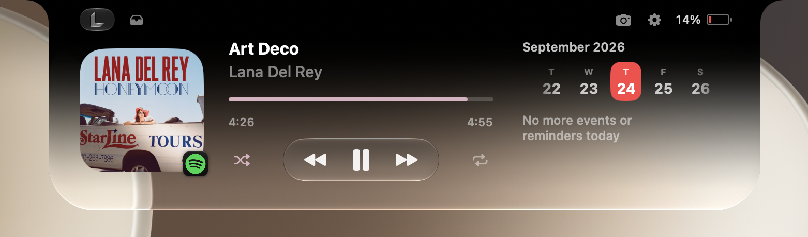

# Lenotch

A black SwiftUI notch for MacBooks with a Now Playing live activity.



- **Closed:** blends into the physical notch.
- **Playing:** the notch widens to show the album art on the left and animated bars on the right.
- **Open** (hover or click, you choose) has fixed player, shelf, and AI usage tabs:
  - **Now Playing:** artwork, title, artist, a progress bar you can drag to seek, play/pause and skip, shuffle and repeat, and a favorite button (Apple Music).
  - **Shelf:** drop files on the notch to keep them, drag them back out, or AirDrop them. Dragging a file onto the closed notch opens the shelf.
  (The camera button in the header drops a small mirrored camera preview down beside the notch.)

  Swipe left or right with two fingers to switch tabs. Scroll the calendar's day strip to change dates.
- **Battery and clock** in the open notch.
- **Calendar options:** choose which calendars and reminder lists appear, scroll to the next event, and show full event titles. Reminders access is optional and requested only when you click Allow.
- **Audio source:** Playing Right Now (any app), Spotify, Apple Music or YouTube Music.
  Spotify and Music are read over AppleScript, so the notch follows them even when another
  app owns Now Playing. macOS asks once for permission.
- **Appearance:** solid black, or black on top fading into Liquid Glass (macOS 26+).
  The equalizer and progress bar can be tinted with the main colour of the album art.
- **Setup and Settings:** a first-launch setup, and a Settings window (menu bar icon → Settings…) where everything can be turned on or off.
- **Real audio visualizer:** the bars in the collapsed notch follow the actual sound (Core Audio tap, macOS 14.2+).
- On displays without a notch, a virtual notch is drawn at the top centre.

Custom AI usage providers (with their own logos) can be added in Settings or as config files: see [docs/provider-config.md](docs/provider-config.md).

Ideas that aren't built yet are listed in [IDEAS.md](IDEAS.md).

## Build & run

Requires macOS 14+ and Xcode / Swift 6 toolchain. Building the installer DMG also
requires `create-dmg` (`brew install create-dmg`).

```bash
./build.sh run       # build build/Lenotch.app and launch it
./build.sh install   # copy to /Applications and launch
./build.sh dmg       # package build/Lenotch.dmg (ARCHS="arm64 x86_64" for a universal build)
```

The DMG opens with a compact drag-to-Applications window with a curved arrow.
The artwork is stored inside the app bundle so Finder shows no installer support
files, and the build checks that the universal image stays below 4 MB.

Sparkle 2 checks the `appcast.xml` of the [latest release](https://github.com/lephorx/lenotch/releases/latest)
for updates. Choose **Check for Updates…**
from the menu bar icon to check manually, or enable automatic checks in General
settings. Sparkle asks about background checks on the second launch.

## Releases

GitHub Actions ([build-dmg.yml](.github/workflows/build-dmg.yml)) builds a universal
`Lenotch.dmg` on pushes to `main`, `dev` or `lenotch-rewrite`, and on pull requests
(download it from the run's artifacts). Pushing a version tag publishes the DMG,
its SHA-256 checksum, and a signed `appcast.xml` as a GitHub Release; the app's
update feed is `releases/latest/download/appcast.xml`, so every release is picked
up automatically. Release builds require the `SPARKLE_PRIVATE_KEY` Actions secret
containing the private key for the public key in `Resources/Info.plist`. The
Sparkle private key is stored locally in Keychain under the `com.lephorx.Lenotch`
account.
Tag the commit on `main` after merging `dev`:

```bash
git tag v2.3 origin/main && git push origin v2.3
```

The app is ad-hoc signed, not notarized, so macOS blocks the first launch. Open it with
right-click → Open, or run `xattr -dr com.apple.quarantine /Applications/Lenotch.app`.

## Project structure

```
Sources/Lenotch/
  App/       SwiftUI App entry (MenuBarExtra), app delegate, settings, window presenter
  Notch/     panel window, placement, hover open/close, geometry
  Media/     NowPlayingService + providers (MediaRemote adapter, AppleScript)
  UI/        notch views: shape, background, live activity, player, battery
  Shelf/     file shelf store and view (drag & drop, AirDrop)
  System/    battery monitor
  Settings/  settings window and first-launch setup
  Audio/     system audio tap and spectrum analysis for the visualizer
scripts/make_icon.sh         regenerates the white logo and Resources/AppIcon.icns from logo.png
Vendor/MediaRemoteAdapter/   BSD-3 licensed, see its LICENSE
```

Since macOS 15.4 third-party apps can't read MediaRemote directly, so Now Playing
runs [mediaremote-adapter](https://github.com/ungive/mediaremote-adapter) via `/usr/bin/perl`.
